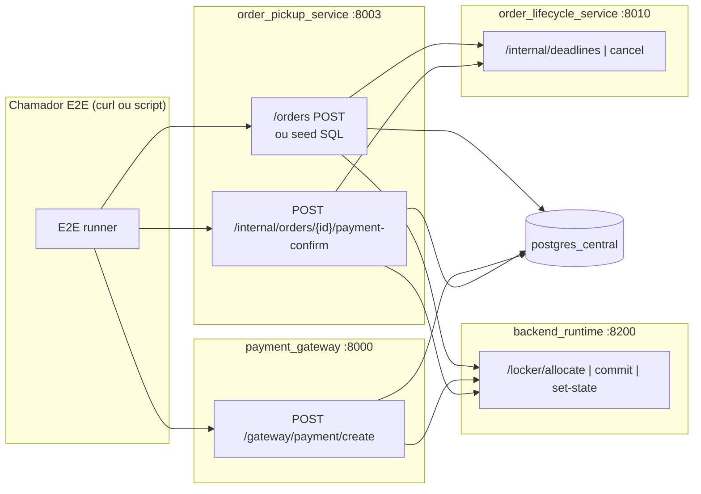
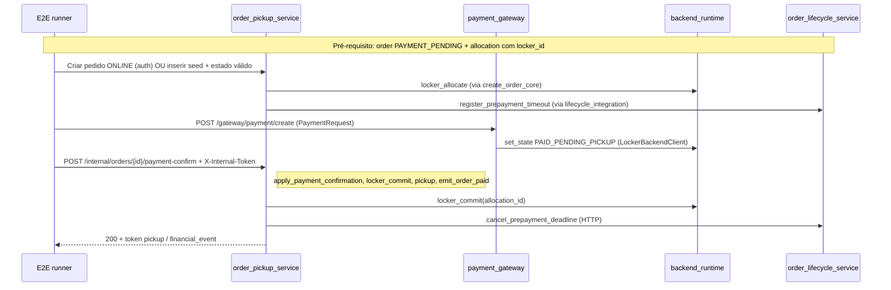

# Desenho — E2E pagamento → runtime / lifecycle (stack mínima)

Objetivo: definir **um job reproduzível** (local + CI) que valide o encadeamento **criar pedido em pagamento pendente → cobrança no gateway → confirmação interna no pickup → commit no runtime → cancelamento de deadline no lifecycle**, sem depender de PSP real nem de browser.

Este documento é a **especificação**; a implementação pode ser feita em fases (P0 → P3).

---

## 1. Escopo e não-objectivos

| In scope | Out of scope (fases posteriores) |
|----------|-----------------------------------|
| HTTP entre serviços já existentes no compose mínimo | UI fora do checkout público (ex.: totem operador completo) |
| Smoke Playwright no `/checkout` (P3, sem stack Docker) | Fluxo DEV no browser em CI sem segredos (fica `test.skip`) |
| `POST /internal/.../payment-confirm` com `X-Internal-Token` | Mercado Pago / Stripe reais (sandbox pode ser P3) |
| `POST` gateway em `/gateway/payment/create` (ou legado `/gateway/pagamento`) | Workers fiscais e emissão NFC-e |
| Health gates e timeouts explícitos | Carga ou paralelismo elevado |

---

## 2. Topologia (stack mínima)

Reutilizar a lista já scriptada em `deploy/compose-minimal-stack.sh`:

- `postgres_central`, `redis_central`, `mqtt`
- `backend_runtime` — alocação / commit / `set-state`
- `order_lifecycle_service` + `order_lifecycle_worker` — deadlines pré-pagamento
- `payment_gateway` — `process_payment` + chamada ao runtime (`LockerBackendClient`)
- `order_pickup_service` — domínio pedido + `POST /internal/orders/{id}/payment-confirm`

**Opcional para “fatura” no E2E:** `billing_fiscal_service` (aumenta tempo de CI e credenciais); manter fora do P0.

---

## 3. Sequência feliz (contrato lógico)

Ordem **recomendada** alinhada ao código atual (o gateway pode atualizar slot no runtime **antes** do pickup confirmar; o pickup faz `locker_commit`, pickup token, eventos e **cancela deadline** no lifecycle).

**Nota de consistência:** o handler interno também chama `_cancel_prepayment_timeout_for_order` **antes** do `locker_commit` (ver `internal.py`); o lifecycle pode receber **dois** cancelamentos idempotentes ou ordem específica — o E2E deve assertar apenas **sucesso final** e estado no DB, não contagem de chamadas, salvo idempotência documentada no lifecycle.

---

## 4. Entradas HTTP concretas

### 4.1 Confirmação interna (obrigatória no E2E)

- **Método / URL:** `POST http://order_pickup_service:8003/internal/orders/{order_id}/payment-confirm`
- **Header:** `X-Internal-Token: <ORDER_INTERNAL_TOKEN>` (mesmo valor que `INTERNAL_TOKEN` / compose).
- **Body (JSON):** modelo `InternalPaymentApprovedIn` (`app/schemas/internal.py`):
  - `order_id`, `region` (`SP` \| `PT`), `totem_id`, `channel` (`ONLINE` \| `KIOSK`)
  - `provider` (ex.: `PIX` em SP, `MBWAY` em PT), `transaction_id`, `amount_cents` (> 0), `currency` (ex.: `BRL` / `EUR` alinhado ao pedido)

### 4.2 Gateway (quando o E2E incluir passo “pagamento no totem”)

- **URL:** `POST http://payment_gateway:8000/gateway/payment/create`
- **Headers:** `Idempotency-Key`, `X-Device-Fingerprint` (o router gera valores se omitidos em alguns fluxos — preferir enviar explícitos no E2E).
- **Body:** `PaymentRequest` (`app/models/payment_model.py`) — campos mínimos dependem de `LOCKER_REGISTRY_JSON` / `locker_id`, `regiao`, `canal`, `porta`, `metodo`, `valor`, opcionalmente `order_id`.

**Fragilidade:** o `process_payment` valida registo de lockers e antifraude; o E2E P0 pode **omitir** a chamada ao gateway e focar **pickup + lifecycle + runtime** com `payment-confirm` apenas, **se** o pedido já estiver `PAYMENT_PENDING` com alocação válida (seed ou create order).

### 4.3 Criar pedido ONLINE (trilha “completa”)

- **URL:** `POST /orders` no router de utilizador (prefixo depende do `main.py` — tipicamente sob prefixo autenticado).
- **Corpo:** `CreateOrderIn` (região, `totem_id`, `sku_id`, `desired_slot`, método, montante, …).
- **Pré-requisitos:** utilizador autenticado (JWT) ou bypass dev; perfil de capabilities e SKUs no Postgres; runtime com slot livre para o `totem_id` de teste.

---

## 5. Dados de teste e seeds

| Fonte | Uso |
|-------|-----|
| Migrações + dados mínimos do compose | SKUs / capabilities por região |
| `02_docker/seed_*.sql` (existentes) | Parceiros / settlements quando necessário |
| **P0:** `02_docker/seeds/seed_e2e_payment_order.sql` | `orders` + `allocations` em `PAYMENT_PENDING` / `RESERVED_PENDING_PAYMENT`, alinhados ao slot e `allocation_id` do `allocate` prévio no runtime |
| Locker lab default (`07_tests/e2e_payment_minimal_stack.sh`) | `SP-CARAPICUIBA-JDMARILU-LK-002` (região SP); candidatos a slot vêm de `GET /locker/slots` (topologia real, **sem** supor 24 portas) |

O seed evita autenticação e create_order_core na primeira versão do job CI.

---

## 6. Gates de saúde (antes dos POST de negócio)

Ordem sugerida (com retry exponencial, ex.: 30 tentativas × 2 s):

1. `GET http://localhost:8200/health` — runtime  
2. `GET http://localhost:8000/health` — gateway  
3. `GET http://localhost:8003/internal/health` com `X-Internal-Token` — pickup (rota em `internal.py`)

Lifecycle: se não houver `GET /health` público, usar smoke `POST /internal/deadlines` com token (ou documentar dependência do worker apenas).

---

## 7. Asserções mínimas (P0)

Após `payment-confirm` bem-sucedido:

1. **HTTP 200** e JSON com `ok`, `status` = `PAID_PENDING_PICKUP` (ou idempotente se repetir o POST).
2. **Postgres:** `orders.status` = `PAID_PENDING_PICKUP`, `orders.payment_status` = `APPROVED`, `allocations.state` = `RESERVED_PAID_PENDING_PICKUP` para o par `order_id` / `allocation_id` do run (validado em `07_tests/e2e_payment_minimal_stack.sh`).
3. **Logs (opcional P1):** grep em `order_pickup_service` por `lifecycle_deadline_cancelled`.

---

## 8. Job GitHub Actions

**Implementado:** `.github/workflows/e2e-payment-minimal-stack.yml`

**Gatilhos:** `workflow_dispatch`, `push`/`pull_request` em paths relevantes (`02_docker/**`, `07_tests/e2e_payment_minimal_stack.sh`, `deploy/**`, serviços da cadeia, `Makefile`).

**Passos atuais:**

1. Checkout  
2. Instalar cliente `psql` no runner  
3. Copiar `02_docker/env.e2e-minimal` para `02_docker/.env` e `01_source/order_pickup_service/.env` (valores só de lab; em CI privado pode substituir por secrets).  
4. `./deploy/compose-minimal-stack.sh` (build + up da stack mínima).  
5. `bash 07_tests/e2e_payment_minimal_stack.sh` — health runtime + pickup + **gateway**, **`POST /orders`** (P2, omissão `E2E_CREATE_ORDER_VIA=seed` para allocate+`psql` legado), **`POST /gateway/payment/create`** (cartão), `payment-confirm`; `PG*` aponta a `127.0.0.1:5435`. `E2E_SKIP_GATEWAY=1` omite o gateway (regressão estilo P0).  
6. **Tear down:** `docker compose down --remove-orphans` (sempre, `if: always()`).

**Workflow Playwright (P3):** `.github/workflows/e2e-payment-ui-playwright.yml` — `npm ci` em `01_source/frontend`, `playwright install chromium`, `npx playwright test` com `PLAYWRIGHT_START_VITE=1` (Vite + smoke `/checkout`); teste DEV completo fica **skipped** sem `E2E_PUBLIC_AUTH_TOKEN` no secret/env.

**Paralelização:** manter **um** job por PR para reduzir flakiness de portas; matriz só se houver regiões distintas (SP vs PT) com stacks isoladas.

---

## 9. Script runner

**Ficheiros:** `07_tests/e2e_payment_minimal_stack.sh` (`make e2e-payment-p0`, stack no ar) e **`07_tests/e2e_payment_ui_playwright.sh`** (`make e2e-payment-ui`, smoke UI sem stack; opcional token para fluxo DEV).

- Lê `E2E_ENV_FILE` / `ORDER_INTERNAL_TOKEN`, `RUNTIME_BASE`, `PICKUP_BASE`, `GATEWAY_BASE` (P1), `PG*`, opcionalmente `E2E_LOCKER_ID`, `E2E_REGION`, `E2E_CURRENCY`, `E2E_PROVIDER`, `E2E_SLOT`, `E2E_USER_ID` / `E2E_USER_EMAIL`, `E2E_SKIP_GATEWAY`, `E2E_AMOUNT_CENTS`, **`E2E_CREATE_ORDER_VIA`** (`http` = P2 com `X-Dev-Bypass-Auth` + `DEV_BYPASS_AUTH` no pickup; `seed` = allocate + `seed_e2e_payment_order.sql`).
- Por omissão tenta resolver `users.id` para `admin.operacao@ellanlab.com` (operador lab; ex.: mesmo utilizador com sessão no FE). Se não existir na BD, `orders.user_id` fica `NULL` com aviso; pode forçar com `E2E_USER_ID=<uuid>` ou desativar o email explícito com `E2E_USER_EMAIL=` (string vazia).
- Obtém a lista de slots candidatos com `GET /locker/slots` + `X-Locker-Id` (topologia real; não assume 24 cacifos).
- `curl -sfS` para health, allocate e `payment-confirm`; asserts JSON via `python3`; asserts SQL no passo final.
- Modo `STRICT=1` vs `SMOKE=1` (futuro, se precisar só health).

Não substitui `make test-payment-contract` (testes unitários de contrato); **complementa** com integração real sobre TCP entre containers.

---

## 10. Riscos e mitigação

| Risco | Mitigação |
|-------|-----------|
| Flaky health / ordem de subida | `depends_on` + loop wait + timeout global no job |
| Registry JSON inconsistente com runtime | Fixture única versionada no repo (`fixtures/locker_registry.e2e.json`) |
| Lifecycle indisponível | Assert 503 documentado vs falha de rede; opcional mock container (fora do P0) |
| Tempo de CI | P0 só pickup + DB + lifecycle + runtime; excluir billing e Metabase |

---

## 11. Encadeamento com o repo atual

| Artefacto existente | Ligação |
|----------------------|---------|
| `deploy/compose-minimal-stack.sh` | Base de infra do E2E |
| `make test-payment-contract` | Rede de segurança **sem** Docker |
| `make e2e-payment-p0` | Mesmo fluxo que o script shell (stack mínima já de pé) |
| `make e2e-payment-ui` | Playwright P3 (`01_source/frontend/e2e/`) |
| `.github/workflows/e2e-payment-minimal-stack.yml` | CI compose + E2E P2 (POST /orders + gateway + pickup) |
| `.github/workflows/e2e-payment-ui-playwright.yml` | CI Node + Playwright smoke (P3) |
| `.github/workflows/backend-test-collect.yml` | CI Python (paralelo ao E2E compose) |
| `docs/Sprint_Fiscal_and_Invoices_ACOMPANHAMENTO.txt` | Registar evolução quando P1 (gateway no meio) estiver verde |

---

## 12. Ordem de implementação sugerida

1. **P0 — Seed + script:** `seed_e2e_payment_order.sql` + `e2e_payment_minimal_stack.sh` com `payment-confirm` + query SQL (sem gateway). Mantido com `E2E_SKIP_GATEWAY=1`.  
2. **P1 — Gateway no meio:** **feito** no mesmo script: health gateway + `POST /gateway/payment/create` com `creditCard` + headers `Idempotency-Key` / `X-Device-Fingerprint`; o gateway chama o runtime `set-state` com **`X-Locker-Id`** (`LockerBackendClient`). Em lab, `GATEWAY_E2E_RELAX_RISK` e URLs `BACKEND_*` / `RUNTIME_BASE_URL` no compose apontam para `backend_runtime` na rede Docker.  
3. **P2 — Create order HTTP:** **feito** no script por omissão (`E2E_CREATE_ORDER_VIA=http`): `POST /orders` com header **`X-Dev-Bypass-Auth: 1`** quando o pickup tem **`DEV_BYPASS_AUTH=true`** (lab/CI via `env.e2e-minimal`); o pickup chama `create_order_core` (allocate no runtime + persistência + lifecycle). Regressão allocate+seed: `E2E_CREATE_ORDER_VIA=seed`. Ficheiro **`02_docker/seeds/seed_e2e_payment_cleanup.sql`** só DELETE (teardown manual opcional).  
4. **P3 — UI:** **feito** em `01_source/frontend` com **`@playwright/test`**: smoke em **`/checkout`** sem query (estado “Checkout inválido”, `data-testid=public-checkout-invalid`); teste opcional **`checkout-dev-full.spec.ts`** com `E2E_PUBLIC_AUTH_TOKEN` (JWT em `localStorage`), `VITE_DEV_BYPASS_AUTH=true`, utilizador com email verificado + perfil fiscal + role `admin_operacao`/`auditoria`, e stack pickup/gateway/runtime; botão **`public-checkout-dev-simulate`**. `FRONTEND_BASE_URL` / `PLAYWRIGHT_START_VITE` documentados em `playwright.config.ts`.

Com P2 + P3 smoke verdes no CI, o Ellan Lab cobre **API (pedido → gateway → pickup)** e **regressão mínima do checkout no browser**, além dos contratos unitários já existentes.
