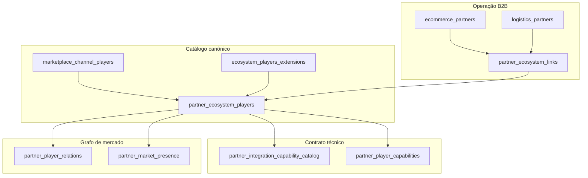

# Ecossistema mundial — Partner OPS (nível profissional)

## Visão em camadas



## `parent_group` — quem é quem

| Grupo | Segmento | Exemplos | Integração típica |
|-------|----------|----------|-------------------|
| `LOCKER_NETWORK` | Operador de rede de lockers | InPost, Bloq, Packeta, Lockars, SwipBox | `LOCKER_NETWORK_API` + `LOCKER_INVENTORY`, `PUDO_RESERVATION` |
| `CARRIER_LAST_MILE` | Carrier / última milha | DHL, DPD, CTT, Correios, Yamato, Chronopost | `DIRECT_API` / `BIDIRECTIONAL` + `LABEL_API`, `TRACKING_PUSH` |
| `MARKETPLACE` | Marketplace / canal venda | ML, Magalu, Amazon, Worten, Trendyol, Allegro | `OAUTH_MARKETPLACE` + `ORDERS_*`, `SETTLEMENT_FEED` |
| `LOGISTICS_PLATFORM` | Agregador / hub envio | Melhor Envio, EasyPost, Sendcloud, nShift | `AGGREGATOR` — um contrato, N carriers |
| `FOOD_DELIVERY` | Food / quick commerce | iFood, Rappi, Uber Eats, Glovo, Deliveroo | `WEBHOOK_INBOUND` + `DELIVERY_STATUS` |
| `RETAIL_PUDO` | Rede loja / pickup retail | 7-Eleven JP, Amazon Hub | `PICKUP_POINT_LIST` |
| `PAYMENTS_FISCAL` | Split / repasse | Stripe Connect, Adyen | `SETTLEMENT_FEED` |

## Relações (`partner_player_relations`)

| `relation_type` | Significado |
|-----------------|-------------|
| `AGGREGATES` | Hub expõe carriers (Melhor Envio → Correios) |
| `USES_LOCKER_NETWORK` | Canal usa rede locker de terceiros |
| `USES_CARRIER` | Canal depende de carrier nacional |
| `OPERATES_WITH` | Operação híbrida (Vinted + Mondial Relay) |
| `PARTNER_NETWORK` | Parceria entre redes/carriers |

## Players além dos “óbvios” (já no seed)

- **Locker EU/US:** Lockars, DeinFach, Luxer One, PIN AG, Fermopoint, bpost Lockers  
- **Carriers:** Chronopost, DPD DE, Yamato, Sagawa, OnTrac, LaserShip, DB Schenker  
- **Hubs:** Sendcloud, nShift, AfterShip, ShipStation  
- **Marketplaces:** Trendyol, Allegro, Kaufland  
- **Food:** Uber Eats, Glovo, Bolt Food, Deliveroo, Just Eat  
- **Retail PUDO:** 7-Eleven JP, Amazon Hub Counter  

Fonte: `ecosystem_players_extensions.py` + `channel_players_catalog.py`.

## API Partner Admin

| Método | Path |
|--------|------|
| POST | `/ecosystem/players/sync-catalog` |
| POST | `/ecosystem/players/seed-professional` |
| POST | `/ecosystem/capability-webhooks/mirror-from-capabilities` |
| GET | `/ecosystem/capability-webhooks` |
| POST | `/ecosystem/capability-webhooks/{id}/test` |
| POST | `/webhooks/ingress/{player_code}/{capability_code}` |
| POST | `/ecosystem/players/seed-priority-partners` |
| GET | `/ecosystem/players/summary` |
| GET | `/ecosystem/players/integration-matrix` |
| GET | `/ecosystem/players/capabilities?player_code=INPOST` |
| GET | `/ecosystem/players/relations` |
| GET | `/ecosystem/players/market-presence?country=BR` |

## Alinhamento cross-serviço

| Serviço | Uso |
|---------|-----|
| **marketplace_admin** | Sellers, listings, readiness — catálogo fonte |
| **ml_admin** | Telemetria, drift — `ml_player_*` espelho |
| **partner_admin** | Contrato B2B, settlements, cadastro `ec-pri-*` / `lg-pri-*` |
| **order_pickup** | `locker_operator_ref` → produção física |

## Fluxo para novo player mundial

1. Entrada em `channel_players_catalog.py` **ou** `ecosystem_players_extensions.py`  
2. `POST sync-catalog` + `POST seed-professional`  
3. (Opcional) `POST seed-priority-partners` se for parceiro comercial OPS  
4. Relação em `player_relations_seed.py` se agregar/usar outro player  
5. Marketplace: seller listing; Partner: vínculo em `partner_ecosystem_links`  

## Postgres central

```bash
cd 02_docker/postgres_central/ops
./apply_partner_ecosystem_migrations.sh
```

Arquivos em `02_docker/postgres_central/migrations/` (004–007). Camada **Global OPS** (certificações, corredores, prontidão por player): ver `docs/GLOBAL_OPS_LAYER.md`.

## Webhooks por capability

| `source` | Origem da URL |
|----------|----------------|
| `MARKETPLACE_MIRROR` | Copia `marketplace_capability_webhooks` (mesmo `locker_central`) |
| `INGRESS` | Receiver interno Partner Admin |
| `SANDBOX_HTTPBIN` | Players prioritários sem espelho marketplace |
| `MANUAL` | OPS via PUT |

`WEBHOOK_DISPATCH_ENABLED=true` envia POST real (HMAC `X-Ellan-Signature`). Default: simula entrega (202).

## Migrações (partner_admin_service)

- `004_partner_ecosystem.sql` — players + links  
- `005_partner_ecosystem_professional.sql` — capabilities, relations, market_presence  
- `006_partner_capability_webhooks.sql` — webhooks + deliveries  
