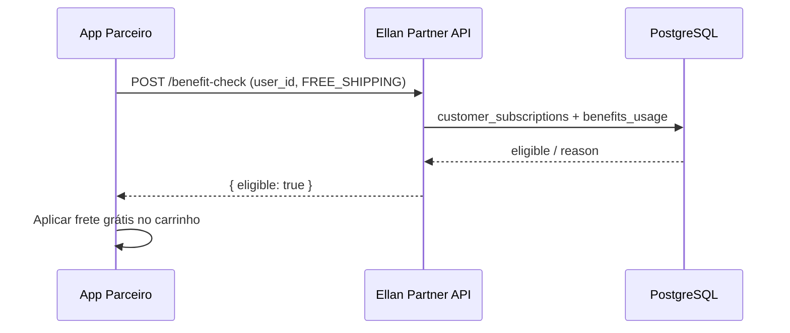

# Contrato de API — Assinaturas (B2C + Parceiros)

Versão: **2026-05-26**  
Serviço: `order_pickup_service` (FastAPI)

Este documento descreve o contrato HTTP para:

1. **API pública B2C** — usuário final autenticado (app/web).
2. **API de parceiros B2B** — marketplaces, operadores locker e integradores com API key.
3. **Referência OPS** — rotas administrativas (resumo; detalhe em código).

---

## Convenções gerais

| Item | Valor |
|------|--------|
| Base URL (dev) | `http://localhost:8003` |
| Formato | JSON (`Content-Type: application/json`) |
| Datas | ISO-8601 UTC (`2026-05-26T12:00:00+00:00`) |
| Valores monetários | **centavos** (integer), moeda padrão `BRL` |
| Erros | `{ "detail": { "type": "CODIGO", "message": "..." } }` ou string em rotas legadas |

### Autenticação B2C (público)

Todas as rotas `/public/subscriptions/*` exigem:

```http
Authorization: Bearer <access_token_jwt>
```

O usuário deve ter **e-mail verificado** (`email_verified = true`). Caso contrário:

```http
HTTP/1.1 403 Forbidden
{
  "detail": {
    "type": "EMAIL_NOT_VERIFIED",
    "message": "Confirme seu e-mail para executar esta ação."
  }
}
```

### Autenticação B2B (parceiro)

Rotas `/api/subscriptions/partner/v1/*` exigem **dois** headers:

```http
X-Partner-Code: magalu
X-API-Key: sub_<token>
```

Alternativa à API key:

```http
Authorization: Bearer sub_<token>
```

A chave é validada contra `subscription_api_keys` (hash SHA-256). Escopos em `scopes_json`:

| Escopo | Uso |
|--------|-----|
| `subscriptions:read` | Consulta assinante, benefit-check |
| `subscriptions:write` | Reservado para futuras mutações B2B |
| `subscriptions:webhook` | Ingestão de eventos (`POST /events`) |

Rotação de chaves: OPS `POST /v1/subscriptions-admin/api-keys/{partner_code}/rotate`.

---

## 1. API pública B2C

Prefixo: **`/public/subscriptions`**

### 1.1 `GET /my`

Retorno consolidado da assinatura ativa (ou ausência).

**Resposta 200 — com assinatura**

```json
{
  "ok": true,
  "has_subscription": true,
  "subscription": {
    "id": "uuid",
    "plan_type": "PREMIUM",
    "status": "ACTIVE",
    "monthly_fee_cents": 2490,
    "billing_cycle": "MONTHLY",
    "benefits": {
      "free_shipping": true,
      "priority_shelf": true,
      "exclusive_deals": false
    },
    "cancel_at_period_end": false,
    "current_period_end": "2026-06-26T12:00:00+00:00",
    "next_billing_at": "2026-06-26T12:00:00+00:00",
    "partner_code": "magalu"
  },
  "plan": {
    "code": "PREMIUM",
    "name": "Premium",
    "monthly_fee_cents": 2490,
    "benefits": { "free_shipping": true, "priority_shelf": true, "exclusive_deals": false }
  },
  "usage": {
    "usage_month": "2026-05",
    "orders_count": 4,
    "free_shipping_used": 2,
    "savings_cents": 1200
  },
  "benefits_usage": [
    { "benefit_type": "FREE_SHIPPING", "usage_count": 2, "usage_limit": 10 }
  ],
  "loyalty": { "balance": 120 },
  "entitled_players_count": 18
}
```

**Resposta 200 — sem assinatura**

```json
{
  "ok": true,
  "has_subscription": false,
  "subscription": null,
  "plan": null,
  "usage": null,
  "benefits_usage": [],
  "loyalty": null,
  "entitled_players_count": 0
}
```

### 1.2 `GET /my/plans`

Catálogo de planos ativos para contratação.

```json
{
  "ok": true,
  "items": [
    {
      "code": "BASIC",
      "name": "Basic",
      "monthly_fee_cents": 990,
      "yearly_fee_cents": 9900,
      "benefits": { "free_shipping": false, "priority_shelf": false, "exclusive_deals": false }
    }
  ],
  "total": 4
}
```

### 1.3 `GET /my/invoices`

Faturas da assinatura ativa (até 12 registros). **404** se não houver assinatura ativa.

### 1.4 `GET /my/entitlements`

Players/rede habilitados pelo plano atual (`subscription_plan_entitlements`). **404** sem assinatura.

### 1.5 `GET /my/loyalty`

```json
{
  "ok": true,
  "balance": 120,
  "history": [
    { "points_delta": 80, "reason": "RENEWAL_BONUS", "balance_after": 120, "created_at": "..." }
  ]
}
```

### 1.6 `POST /my/benefit-check`

Valida elegibilidade no checkout (frete grátis, prateleira prioritária, oferta exclusiva).

**Request**

```json
{ "benefit_type": "FREE_SHIPPING" }
```

Valores: `FREE_SHIPPING` | `PRIORITY_SHELF` | `EXCLUSIVE_DEAL`

**Response**

```json
{
  "ok": true,
  "eligible": true,
  "benefit_type": "FREE_SHIPPING",
  "reason": null,
  "subscription_id": "uuid",
  "plan_type": "PREMIUM",
  "usage_count": 2,
  "usage_limit": 10
}
```

| `reason` | Significado |
|----------|-------------|
| `NO_ACTIVE_SUBSCRIPTION` | Usuário sem assinatura ACTIVE/TRIALING |
| `PLAN_DOES_NOT_INCLUDE_BENEFIT` | Plano não inclui o benefício |
| `USAGE_LIMIT_REACHED` | Cota mensal esgotada |

### 1.7 `POST /my/subscribe`

Cria assinatura se não existir outra ativa.

**Request**

```json
{
  "plan_code": "PREMIUM",
  "billing_cycle": "MONTHLY",
  "partner_code": "magalu",
  "trial_days": 7,
  "promo_code": "WELCOME20"
}
```

Com `promo_code`, o valor de `monthly_fee_cents` da assinatura já nasce com desconto; o resgate é gravado em `subscription_promo_redemptions`. Resposta inclui `promo_applied` quando o cupom foi aceito.

| HTTP | `type` |
|------|--------|
| 409 | `ALREADY_SUBSCRIBED` |
| 422 | `PLAN_NOT_FOUND` |

Emite evento `subscription.created` em `subscription_events`.

### 1.8 `POST /my/cancel`

**Request**

```json
{ "immediate": false, "reason": "optional string" }
```

- `immediate: false` — cancela ao fim do período (`cancel_at_period_end = true`).
- `immediate: true` — cancelamento imediato (`status = CANCELLED`).

### 1.9 `GET /my/referral`

Retorna código de indicação existente ou cria um novo (`ELLAN-XXXXXX`, recompensa padrão 500 centavos).

### 1.10 `POST /promo/validate`

Valida cupom promocional antes da assinatura ou upgrade.

**Query**

| Parâmetro | Obrigatório | Descrição |
|-----------|-------------|-----------|
| `code` | sim | Código do cupom (ex. `WELCOME20`) |
| `plan_code` | sim | Plano alvo da validação |

**Resposta 200 — válido**

```json
{
  "ok": true,
  "valid": true,
  "code": "WELCOME20",
  "discount_cents": 198,
  "discount_pct": 20,
  "bonus_months": 0,
  "description": "Boas-vindas −20%"
}
```

**Resposta 200 — inválido** (`valid: false`, `reason`: `PROMO_NOT_FOUND`, `PLAN_NOT_ELIGIBLE`, `ALREADY_REDEEMED`, etc.)

### 1.11 `GET /my/upgrade-suggestions`

Sugestões de upgrade com base no medidor `ORDERS` do mês corrente (apenas assinaturas do usuário autenticado).

```json
{
  "ok": true,
  "period_month": "2026-05",
  "items": [
    {
      "subscription_id": "…",
      "current_plan": "BASIC",
      "suggested_plan": "PREMIUM",
      "usage_pct": 90.0,
      "overage_cents": 0
    }
  ],
  "total": 1
}
```

### 1.12 `POST /my/change-plan`

Muda o plano da assinatura ativa (upgrade/downgrade com proration simples).

**Request** — mesmo corpo de `POST /my/subscribe` (usa `plan_code`, opcional `promo_code`):

```json
{ "plan_code": "PREMIUM", "promo_code": "WELCOME20" }
```

Na assinatura bem-sucedida, `promo_applied` descreve o desconto resgatado (resgate único por usuário/cupom).

**Resposta 200**

```json
{
  "ok": true,
  "change_id": "…",
  "from_plan": "BASIC",
  "to_plan": "PREMIUM",
  "change_type": "UPGRADE",
  "proration_cents": 1500,
  "new_monthly_fee_cents": 2490
}
```

| HTTP | `type` |
|------|--------|
| 404 | `NO_SUBSCRIPTION` |
| 422 | `PLAN_NOT_FOUND` |

---

## 2. API de parceiros B2B

Prefixo: **`/api/subscriptions/partner/v1`**

### 2.1 `GET /health`

Valida credenciais e lista escopos da chave.

```json
{
  "ok": true,
  "partner_code": "magalu",
  "scopes": ["subscriptions:read", "subscriptions:webhook"]
}
```

### 2.2 `GET /subscribers/{user_id}`

Consulta assinatura ativa do usuário no ecossistema Ellan.

```json
{
  "ok": true,
  "found": true,
  "user_id": "user-123",
  "subscription": { "...": "mesmo formato B2C" },
  "plan": { "...": "resumo do plano" },
  "benefits": { "free_shipping": true, "priority_shelf": false, "exclusive_deals": false }
}
```

`found: false` quando não há assinatura ACTIVE/TRIALING/PAST_DUE.

### 2.3 `POST /benefit-check`

Mesmo contrato de `POST /public/subscriptions/my/benefit-check`, com corpo:

```json
{
  "user_id": "user-123",
  "benefit_type": "FREE_SHIPPING",
  "partner_order_ref": "MLB-999888"
}
```

Parceiros podem validar assinaturas **PAST_DUE** (útil para retenção antes de bloquear benefício).

### 2.4 `POST /events`

Telemetria opcional (não substitui webhooks outbound OPS).

```json
{
  "event_type": "partner.checkout.completed",
  "user_id": "user-123",
  "subscription_id": null,
  "payload": { "order_ref": "MLB-999888" }
}
```

Requer escopo `subscriptions:webhook`.

---

## 3. Webhooks outbound (Ellan → parceiro)

Configuração OPS: `PUT /v1/subscriptions-admin/webhooks/{partner_code}`

| Campo | Descrição |
|-------|-----------|
| `url` | HTTPS endpoint do parceiro |
| `events` | Lista de tipos subscritos |
| `secret` | Retornado uma vez; usar para HMAC |

Eventos típicos:

- `subscription.created`
- `subscription.renewed`
- `subscription.cancelled`
- `subscription.past_due`

Simulação OPS: `POST /v1/subscriptions-admin/webhook-deliveries/simulate`

Entregas logadas em `subscription_webhook_deliveries`.

---

## 4. Referência OPS (interno)

| Prefixo | Auth |
|---------|------|
| `/v1/subscriptions-admin` | Role `admin_operacao` |
| `/internal/subscriptions` | Header `X-Internal-Token` |

Inclui: planos, assinaturas, seed, ecossistema mundial, invoices, dunning, premium (health, referrals, gifts, experiments).

Documentação de schema SQL: `02_docker/complete_schema_20260525_d.sql`

---

## 5. Fluxos recomendados

### Checkout com benefício (parceiro)



### Onboarding B2C

1. `GET /public/subscriptions/my/plans`
2. `POST /public/subscriptions/my/subscribe`
3. `GET /public/subscriptions/my` (confirmar)
4. No checkout Ellan: `POST /public/subscriptions/my/benefit-check`

### Cancelamento

1. `POST /public/subscriptions/my/cancel` com `immediate: false`
2. Parceiro recebe webhook `subscription.cancel_scheduled` (quando configurado)

---

## 6. Códigos de plano

| Código | Uso típico |
|--------|------------|
| `BASIC` | Entrada |
| `PREMIUM` | B2C com frete + prateleira |
| `PRO` | Alto volume / mais players |
| `ENTERPRISE` | B2B / white-label |

Entitlements por player: tabela `subscription_plan_entitlements`, sincronizados via OPS `POST /sync/ecosystem-full`.

---

## 7. Exemplos cURL

### B2C — minha assinatura

```bash
curl -s -H "Authorization: Bearer $TOKEN" \
  http://localhost:8003/public/subscriptions/my | jq
```

### B2C — benefit check

```bash
curl -s -X POST -H "Authorization: Bearer $TOKEN" \
  -H "Content-Type: application/json" \
  -d '{"benefit_type":"FREE_SHIPPING"}' \
  http://localhost:8003/public/subscriptions/my/benefit-check | jq
```

### Parceiro — lookup

```bash
curl -s \
  -H "X-Partner-Code: magalu" \
  -H "X-API-Key: sub_xxxxxxxx" \
  http://localhost:8003/api/subscriptions/partner/v1/subscribers/user-123 | jq
```

### Parceiro — benefit check

```bash
curl -s -X POST \
  -H "X-Partner-Code: magalu" \
  -H "X-API-Key: sub_xxxxxxxx" \
  -H "Content-Type: application/json" \
  -d '{"user_id":"user-123","benefit_type":"FREE_SHIPPING"}' \
  http://localhost:8003/api/subscriptions/partner/v1/benefit-check | jq
```

---

## 8. Módulo global (OPS + B2C)

### Tabelas

| Tabela | Finalidade |
|--------|------------|
| `subscription_regional_prices` | Preço por plano × região (BR, PT, EU, UK, US) |
| `subscription_plan_addons` | Catálogo de add-ons (locker extra, family seat, ESG…) |
| `subscription_active_addons` | Add-ons ativos por assinatura |
| `subscription_pause_periods` | Pausa programada (viagem, etc.) |
| `subscription_sla_targets` | SLA por plano/região (uptime, suporte, food handoff) |
| `subscription_partner_settlements` | Repasse financeiro mensal a parceiros |
| `subscription_retention_offers` | Ofertas ao cancelar (STAY20, etc.) |
| `subscription_consent_records` | LGPD — termos, privacidade, marketing |

### OPS (`/v1/subscriptions-admin/world/*`)

- `GET /world/summary` — contadores
- `GET /world/regional-prices`, `GET /world/addons/catalog`, `GET /world/sla-targets`
- `GET /world/settlements`, `POST /world/settlements/{id}/mark-paid`
- `GET /world/retention-offers`, `POST /world/retention-offers`, `POST .../accept`
- `POST /world/seed`

### B2C adicional

| Rota | Descrição |
|------|-----------|
| `GET /public/subscriptions/my/regional-price?region=PT` | Preço localizado |
| `GET /public/subscriptions/my/addons` | Add-ons ativos + catálogo |
| `GET /public/subscriptions/my/retention-offer` | Oferta antes do churn |
| `POST /public/subscriptions/my/retention-offer/{id}/accept` | Aceitar desconto e estender período |

---

## 9. Módulo eficiência (OPS + B2C)

### Tabelas

| Tabela | Finalidade |
|--------|------------|
| `subscription_promo_codes` | Cupons promocionais (%, centavos, bônus de meses) |
| `subscription_promo_redemptions` | Resgate único por usuário/cupom |
| `subscription_plan_changes` | Histórico upgrade/downgrade + proration |
| `subscription_usage_meters` | Medidores mensais (ORDERS, LOCKER_PICKUPS, FOOD_ORDERS) |
| `subscription_automation_rules` | Regras trigger → ação (retenção, webhook, evento) |
| `subscription_family_members` | Assentos família (até 5 por assinatura) |

### OPS (`/v1/subscriptions-admin/efficiency/*`)

- `GET /efficiency/ops-inbox` — fila unificada (dunning, churn, renovações vencidas, retenção)
- `GET|POST /efficiency/promo-codes`, `POST /efficiency/promo-codes/validate`
- `GET|POST /efficiency/plan-changes`
- `GET|POST /efficiency/usage-meters`, `GET /efficiency/upgrade-matrix`
- `GET|POST /efficiency/automation-rules`, `POST /efficiency/automation-rules/evaluate`
- `GET|POST /efficiency/family-members`
- `POST /efficiency/seed`, `GET /efficiency/summary`
- `GET /efficiency/ops-inbox` — itens com array `actions` (rótulo + `action`) e `bulk_operations`
- `POST /efficiency/ops-inbox/act` — corpo `{ "kind": "CHURN|RENEWAL|…", "id": "…", "action": "resolve|process|accept|decline|apply_upgrade" }`
- `POST /efficiency/ops-inbox/bulk` — `{ "operation": "renewals_run_due" | "churn_resolve_high" | "churn_resolve_all" }`

| kind | Ações |
|------|--------|
| DUNNING | `resolve` |
| CHURN | `resolve` |
| RENEWAL | `process` (uma fila) |
| RETENTION | `accept`, `decline` |
| UPGRADE | `apply_upgrade` (upgrade sugerido por uso) |

### B2C (seção 1.10–1.12)

Cupom, sugestões de upgrade e mudança de plano na API pública autenticada.

---

## 10. Changelog

| Data | Alteração |
|------|-----------|
| 2026-05-26 | Módulo eficiência: cupons, plan changes, meters, automações, family, OPS inbox |
| 2026-05-26 | B2C: `POST /promo/validate`, `GET /my/upgrade-suggestions`, `POST /my/change-plan` |
| 2026-05-26 | Módulo global: preços regionais, add-ons, pausas, SLA, settlements, retenção, LGPD |
| 2026-05-26 | API pública ampliada (`/my/*`, subscribe, cancel, referral) |
| 2026-05-26 | API parceiros `partner/v1` com API key + escopos |
| 2026-05-26 | Documento inicial de contrato |
